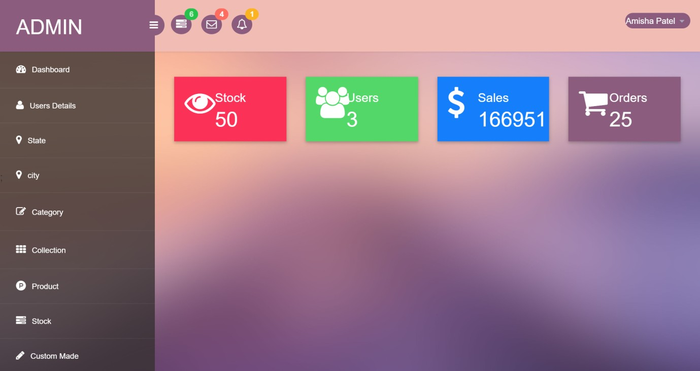
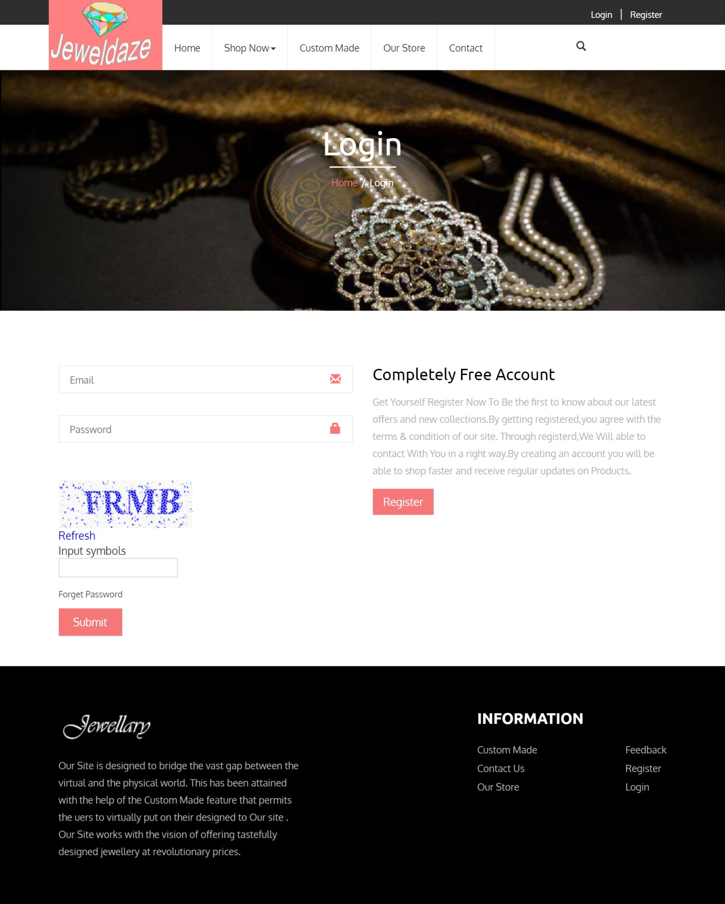
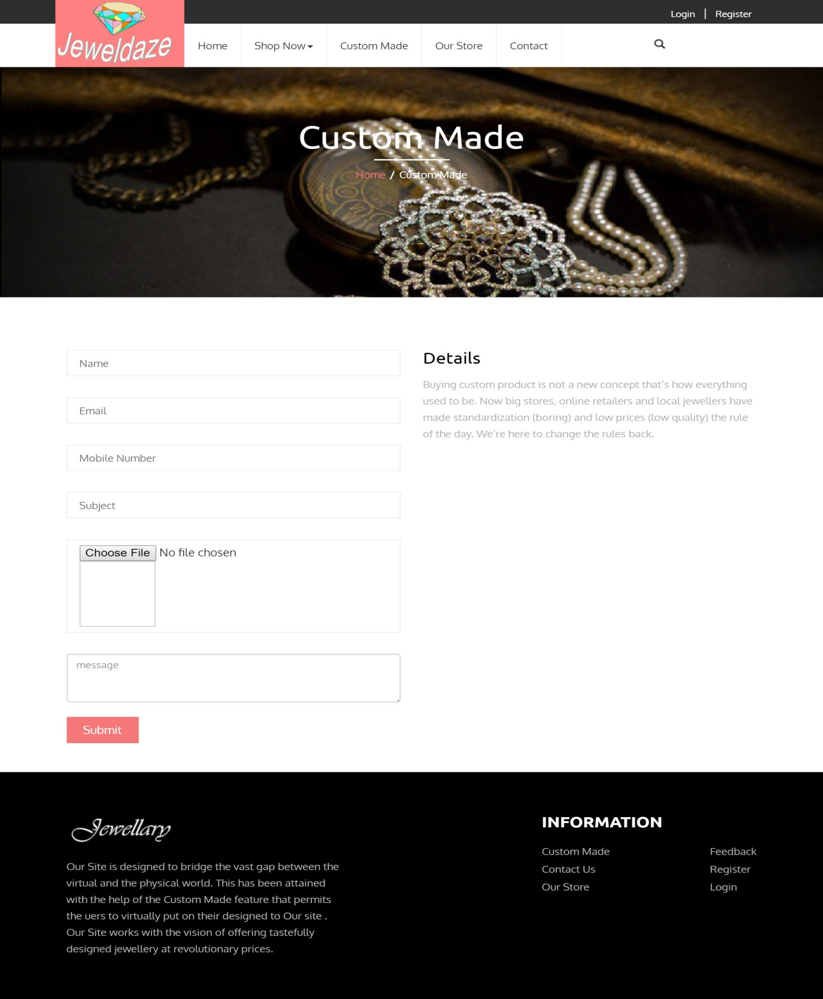
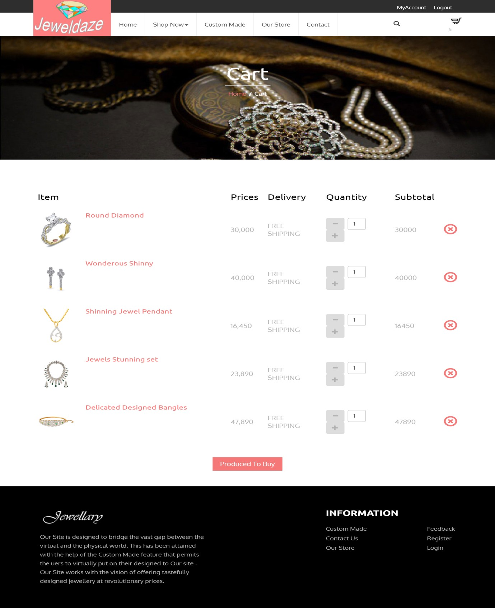
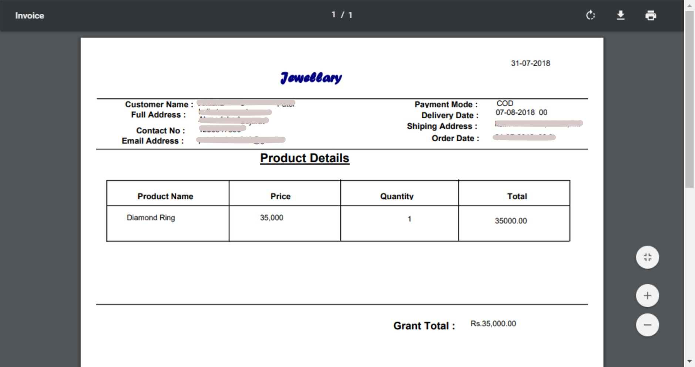

# 💍 Jeweldaze – Online Jewellery Shopping System

**Jeweldaze** is an advanced web-based solution for online jewellery shopping that connects customers with beautiful collections and custom jewellery, all from the comfort of their homes. The platform digitizes the traditional in-store experience and provides seamless features like online browsing, custom designs, order, and invoice management.

---

## 🎯 Project Definition

**Jeweldaze** is an online jewellery shopping system that allows customers to:
- Browse and shop for jewellery collections like **Bridal**, **Gemstone**, **Diamond**, **Novelty**, and more.
- Purchase items in categories such as **Rings, Pendants, Bangles, Earrings, Chains, Necklaces**, etc.
- Customize their jewellery and even receive location directions to the shop if needed.

Modules:
- **[A] Admin**
- **[B] Customer**

---

## 🔍 Existing System

The current jewellery shopping experience is offline:
- Customers must physically visit stores.
- Merchants manage records manually.
- Issues due to time, location, and file-based systems.

## 💡 Proposed System

Jeweldaze transforms this into a computerized, online system:
- Customers shop online, customize orders, and get home delivery.
- Admins manage orders, products, users, and stock in real time.

---

## 📦 System Modules

### 👤 Customer Module
- Register/login with verification and captcha.
- Browse collections and categories.
- Add items to shopping bag.
- Choose custom-made jewellery.
- Track order history and manage profile.
- View shop location on map.
- Get invoices (download/print).

### 🛠️ Admin Module
- Manage user accounts and block users if needed.
- Get notifications on orders and custom requests.
- Modify product details and manage collections.
- Monitor system activity and user feedback.
- Maintain stock for each jewellery item.

---

## 🛠️ Software Requirements

| Component     | Technology                      |
|---------------|----------------------------------|
| Language      | C#                               |
| Platform      | .NET MVC                         |
| Frontend      | ASP.NET MVC                      |
| Backend       | SQL Server Management Studio     |

---

## 🖼️ Visualizations

Below are the key interface screenshots of the Jeweldaze system:

### 🧑‍💼 Admin Dashboard

---

### 🔔 Notification Panel

---

### 👥 Customer 

---

### 🔐 Login Page

---

### 💎 Product Details

---

### 📝 Custom Request

---

### 🛒 Cart

---

### 🧾 Invoice

---

## 🚀 Features at a Glance

✅ Online Jewellery Store Access  
✅ Product Filtering by Category & Collection  
✅ Secure Login and Captcha Verification  
✅ Map Location View for Physical Store  
✅ Email Verification for Online Payments  
✅ Custom Order Options for Personalized Jewellery  
✅ Real-Time Stock Management  
✅ Invoice Generation (Download/Print)  
✅ Admin Panel with Notifications and Analytics  

---
